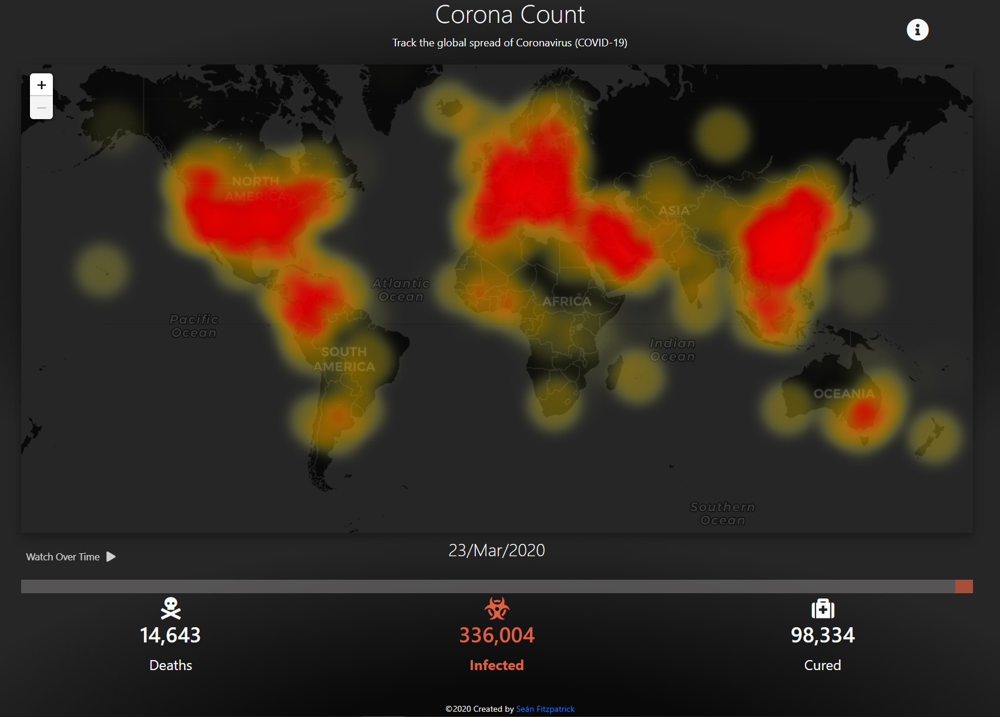
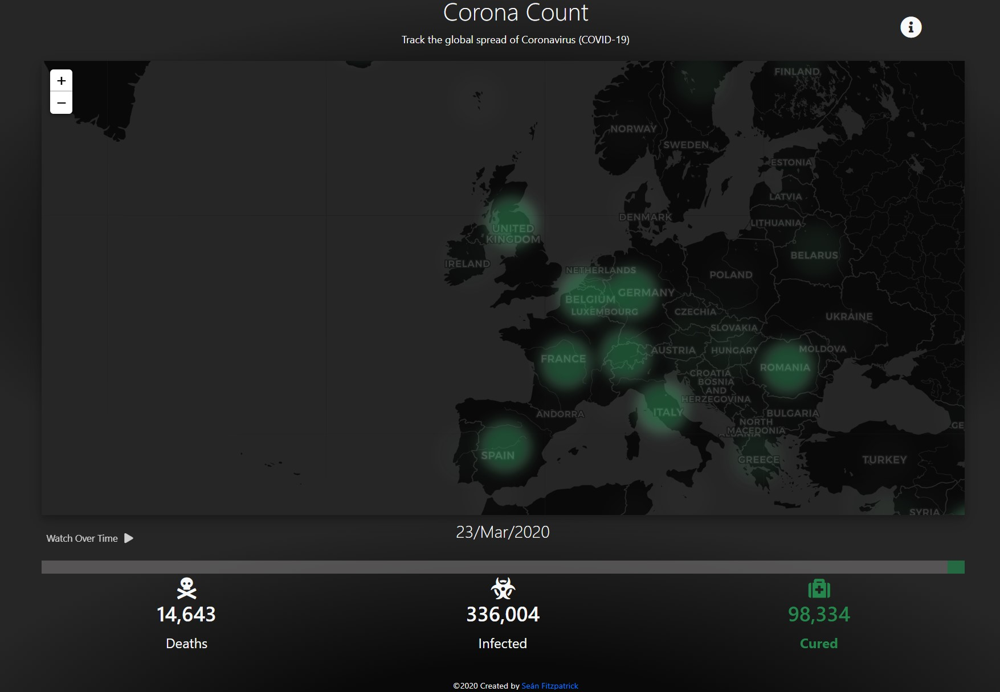

# Corona_Spread_Visualisation

React app to visualize the spread of Coronavirus
View live site [Here](https://corona-count.com/)

# View spread of the Coronavirus (image from 23rd of March 2020)

# View infection, cures and deaths data for a specific date and area

